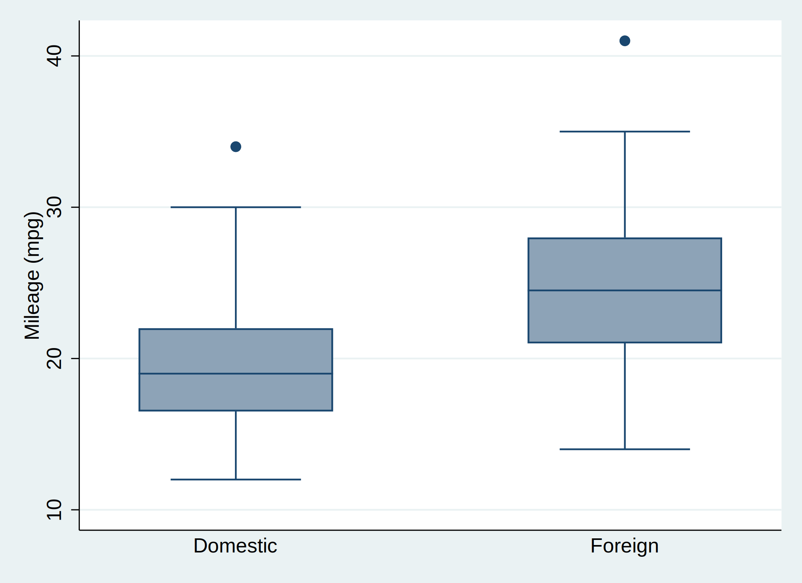

class: middle, center

# Setup

---

Familiarity with **Rmarkdown** is assumed. In order to run **Stata** directly from within **Rmarkdown**, you need to run the following code chunk. Note that this only works if you have **Stata** already installed in your own machine.

```{r setup, warning = FALSE, message = FALSE}
# Package
library(Statamarkdown)

# Path to the executable Stata (machine-specific)
statapath <- "/Applications/Stata/StataIC.app/Contents/MacOS/StataIC"

# Set the Stata engine
knitr::opts_chunk$set(engine.path = list(stata = statapath))
```

To find your own path to the executable **Stata**:

1. Open **Stata**
1. Type `sysdir` in the Stata command window
1. The output that says `STATA:` indicates where the path is
1. Put the additional argument as shown in the code chunk above

I am using **StataIC** on a Mac, hence the path. Adjust the path accordingly since you may have a different version of **Stata** or operation system.

After all that, executing **Stata** code in **Rmarkdown** would be the same as if you worked in **R**. However, you need to specify the code chunk as follows.

` ```{stata} Your code``` `

---
class: middle, center

# Stata code with output

---
# Summarise data

```{stata, collectcode = TRUE}
sysuse auto, clear  // Read in the data
summarize           // Summarise data
```

To carry over the results from this code (e.g. loaded dataset) in subsequent operations, we need to specify the code chunk as follows.

` ```{stata, collectcode = TRUE} Your code``` `

---
# Univariable linear regression

```{stata} 
regress price mpg
```

---
# Plot

```{stata, results = "hide"}
graph box mpg, over(foreign) // Box plot

// Save the plot to show as follows (not a direct output)
graph export "boxplot.svg", replace
```

<p align="center">

  

</p>

---
class: middle, center

# Any questions?

#### ihsan.fadilah@kcl.ac.uk

#### Reference ~ [Stata and R Markdown: the Statamarkdown package](https://www.ssc.wisc.edu/~hemken/Stataworkshops/stata.html#stata-and-r-markdown)


